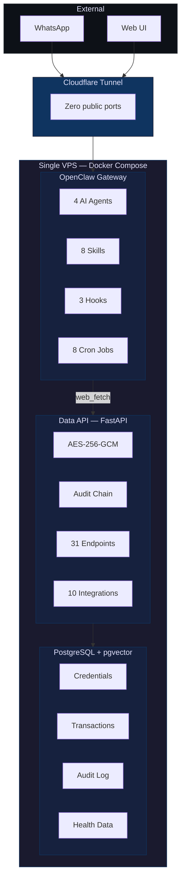

Aegis is a _personal intelligence platform_ that runs on your own server. It connects your bank accounts, calendars, coursework, fitness trackers, and social media -- then delivers actionable insights over WhatsApp. Morning briefings at 6 AM, spending alerts, deadline warnings, health goal tracking, and AI-generated LinkedIn/X posts -- all from a single Docker Compose stack with zero public ports.

Built on [OpenClaw](https://github.com/openclaw/openclaw). 4 containers. ~2,700 lines of custom code. Everything encrypted at rest with AES-256-GCM.

---

## How It Works

Aegis is a skill pack + encrypted data layer for **OpenClaw**, the open-source personal AI assistant. OpenClaw provides the agent runtime, scheduling, WhatsApp delivery (Baileys), web UI, and memory. Aegis teaches it how to manage your finances, calendar, coursework, health, and social media through 8 custom skills that call a private FastAPI service.



**OpenClaw** = the brain. Agents, cron scheduling, LLM calls, WhatsApp (Baileys), web UI, agent memory (LanceDB), session management.

**Data API** = the vault. Encrypted credential storage, integration API proxies, tamper-evident audit log, budget tracking. No analysis, no LLM calls, no delivery -- just stores and retrieves.

---

## The 4 Docker Services

Aegis runs as a single Docker Compose stack with exactly 4 services:

| Service | Technology | Purpose |
|---------|-----------|---------|
| `openclaw-gateway` | OpenClaw (Node.js) | Agents, channels, cron, UI, hooks -- the entire application runtime |
| `data-api` | FastAPI + Python 3.12+ | Encrypted data persistence with 31 endpoints, 10 routers, 9 models |
| `postgres` | PostgreSQL 16+ (pgvector) | Financial data, audit log, credentials, health metrics |
| `cloudflared` | Cloudflare Tunnel | External zero-trust access with zero public ports |

### OpenClaw Gateway

The gateway is the heart of Aegis. It runs on port 18789 and handles:
- **4 AI agents** with different models and purposes
- **WhatsApp integration** via Baileys (native, no external bridge)
- **8 cron jobs** for scheduled automation
- **8 custom skills** that teach agents how to query data
- **3 security hooks** that intercept events
- **Web UI** for management and chat at `http://localhost:18789`
- **Agent memory** stored in LanceDB

### Data API

The data-api is a thin encrypted persistence layer (~1,500 LOC) that OpenClaw agents call via `web_fetch`. It provides:
- **31 REST endpoints** across 10 routers
- **AES-256-GCM encryption** for all credentials and sensitive fields
- **10 integration clients** (Plaid, Schwab, Canvas, Blackboard, Garmin, Google Calendar, Outlook Calendar, LinkedIn, X, and a base class)
- **SHA-256 hash-chained audit log** for tamper-evident event tracking
- **LLM budget tracking** with per-model token pricing
- **Bearer token auth** via `hmac.compare_digest` (single machine-to-machine caller)

### PostgreSQL

PostgreSQL 16+ with extensions:
- **pgvector** for vector similarity search
- **pgcrypto** for additional encryption primitives
- **uuid-ossp** for UUID generation

Stores 9 model types: credentials, accounts, transactions, assignments, health metrics, audit log entries, LLM usage records, content drafts, and social posts.

### Cloudflare Tunnel

Provides external access with:
- Zero public ports on the VPS
- Token-based authentication
- TLS encryption for all external traffic

---

## Data Flow

### Interactive Flow (User Message)

```
1. User sends WhatsApp message
2. Cloudflare Tunnel receives and forwards to gateway
3. Gateway routes to the main agent (Claude Sonnet)
4. Agent reads workspace files (BOOT.md, skills)
5. Agent reasons about the request using its LLM
6. Agent calls web_fetch to query data-api endpoints
7. Data-api decrypts data from PostgreSQL and returns it
8. Agent formats the response
9. pii-guard hook scans for SSNs/cards/accounts and redacts
10. audit-logger hook logs the event to data-api
11. budget-guard hook tracks token spend
12. Gateway delivers response to WhatsApp
```

### Cron Flow (Scheduled Task)

```
1. Cron trigger fires at scheduled time
2. Gateway starts an isolated session for the assigned agent
3. Agent receives the job's payload message (instructions)
4. Agent calls web_fetch to trigger data-api sync/query endpoints
5. Data-api calls external APIs (Plaid, Canvas, etc.)
6. Data-api encrypts and stores results in PostgreSQL
7. If delivery mode is "announce": agent composes a summary
8. Hooks process the outbound message
9. Gateway delivers to WhatsApp (or silently completes)
```

---

## Network Architecture

### Docker Networks

Three isolated Docker networks:
- **frontend** -- OpenClaw gateway and cloudflared (external-facing)
- **backend** (internal) -- OpenClaw gateway and data-api (service-to-service)
- **data** (internal) -- data-api and PostgreSQL (database access)

### Security Constraints

All containers run with:
- `cap_drop: [ALL]` -- no Linux capabilities
- `no-new-privileges: true` -- prevent privilege escalation
- Production: `read_only: true` filesystem with tmpfs for `/tmp`

---

## Key Subsystems

### Encrypted Persistence

AES-256-GCM field encryption with AAD context binding. Each credential is encrypted with a unique nonce and additional authenticated data (resource type + user ID). Implemented in `data-api/app/security/encryption.py`.

### Audit Chain

Every API call and agent event is logged to a SHA-256 hash-chained tamper-evident log in PostgreSQL. Chain integrity is verifiable via `GET /audit/verify`. Any break in the chain indicates tampering. Implemented in `data-api/app/security/audit.py`.

### Budget Enforcement

Token-level LLM spend tracking with model-specific pricing:
- claude-haiku-4-5: $0.80/$4.00 per 1M tokens (input/output)
- claude-sonnet-4-6: $3.00/$15.00 per 1M tokens
- claude-opus-4-6: $15.00/$75.00 per 1M tokens

Warns at 80/95% of daily ($5) and monthly ($50) budgets; blocks at 100%. Implemented in `hooks/budget-guard/` and `data-api/app/api/budget.py`.

### PII Redaction

Regex hook intercepts all outbound messages and redacts:
- SSNs (`123-45-6789`, `123 45 6789`, 9 consecutive digits)
- Credit/debit cards (16 digits, any separators)
- Bank account numbers (10-17 consecutive digits, preserves last 4)

Runs synchronously before WhatsApp delivery. Implemented in `hooks/pii-guard/`.

### Skill Platform

8 SKILL.md files with YAML frontmatter that teach OpenClaw agents how to call data-api endpoints via `web_fetch`. Skills replace Python service files -- the LLM does the reasoning; skills teach data queries. Auto-discovered at startup with file watch support.

---

## Project Structure

```
lifemanagement-kit/
├── config/                         # OpenClaw configuration
│   ├── openclaw.json               # Agents, channels, cron, hooks
│   ├── cron/jobs.json              # 8 scheduled jobs
│   ├── BOOT.md                     # Agent orientation (loaded on startup)
│   ├── USER.md                     # User profile and preferences
│   └── MEMORY.md                   # Persistent agent memory
├── skills/                         # 8 custom skill definitions
│   ├── aegis-finance/SKILL.md
│   ├── aegis-calendar/SKILL.md
│   ├── aegis-lms/SKILL.md
│   ├── aegis-health/SKILL.md
│   ├── aegis-social/SKILL.md
│   ├── aegis-content/SKILL.md
│   ├── aegis-briefing/SKILL.md
│   └── aegis-security/SKILL.md
├── hooks/                          # 3 custom hooks (TypeScript)
│   ├── audit-logger/
│   ├── pii-guard/
│   └── budget-guard/
├── data-api/                       # Encrypted persistence (FastAPI)
│   ├── pyproject.toml
│   ├── alembic/                    # Database migrations
│   ├── app/
│   │   ├── main.py                 # FastAPI app, Bearer auth, audit middleware
│   │   ├── config.py               # Pydantic Settings
│   │   ├── database.py             # Async SQLAlchemy engine + sessions
│   │   ├── security/               # AES-256-GCM + audit log
│   │   ├── models/                 # 9 SQLAlchemy models
│   │   ├── api/                    # 10 routers (31 endpoints)
│   │   └── integrations/           # 10 API clients
│   └── tests/                      # 113 tests
├── infrastructure/
│   ├── Dockerfile.data-api         # Multi-stage Python 3.12-slim
│   ├── cloudflared/config.yml
│   ├── postgres/init.sql
│   └── scripts/                    # bootstrap, deploy, backup, restore
├── docker-compose.yml              # 4 services
├── docker-compose.prod.yml         # Production overrides
├── docker-compose.override.yml     # Dev port bindings
├── .env.example                    # Environment template
└── Makefile                        # dev, test, lint, deploy shortcuts
```

---

## Integrations (10 Clients)

All integrations follow the `BaseIntegration` abstract base class pattern:

| Integration | Method | Library | Status |
|------------|--------|---------|--------|
| Plaid (Banking) | Plaid API | `plaid-python` | Fully supported |
| Schwab (Investments) | Schwab API | `schwab-py` | Partial (read access solid) |
| Canvas LMS | Canvas REST API | `httpx` | Fully supported |
| Blackboard Learn | Web API | `httpx` | Fully supported |
| Garmin Connect | Unofficial API | `garminconnect` | Unofficial (may break) |
| Google Calendar | Google Calendar API v3 | `httpx` | Fully supported |
| Outlook Calendar | Microsoft Graph API | `httpx` | Fully supported |
| LinkedIn | LinkedIn API | `httpx` | Very limited (requires approved app) |
| X / Twitter | X API v2 | `httpx` | Supported (paid, $100/mo Basic) |
| Apple Health | iOS Shortcuts | POST to `/health/ingest` | Indirect (no direct API) |
